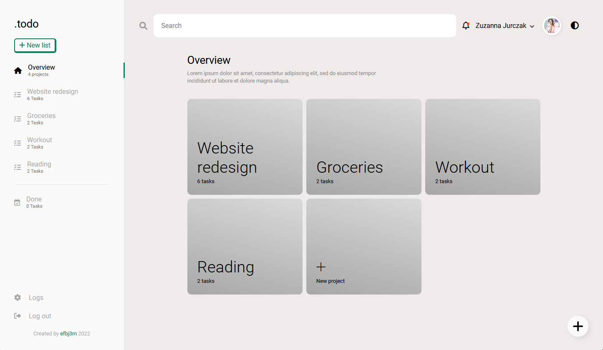
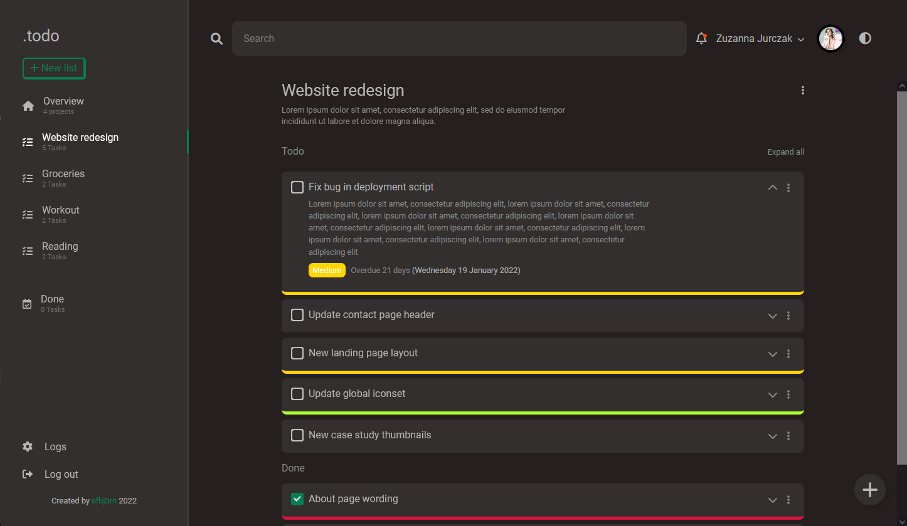
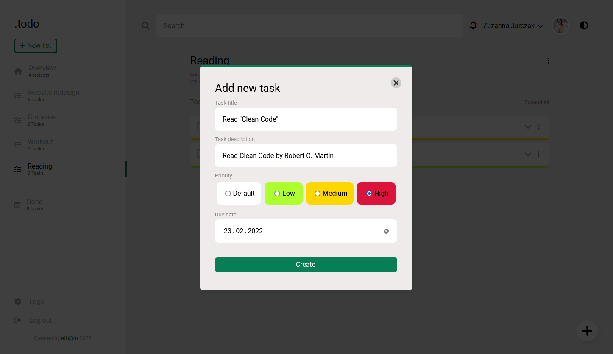

# Todo List Application
Simple todo list application written in JavaScript (ES6)

[Live App](https://archloner.github.io/todo-list/)

## Demo

## UI design
User interface design is a composition of two designs found by me on the internet.

Overview page

Dark mode support

New task modal